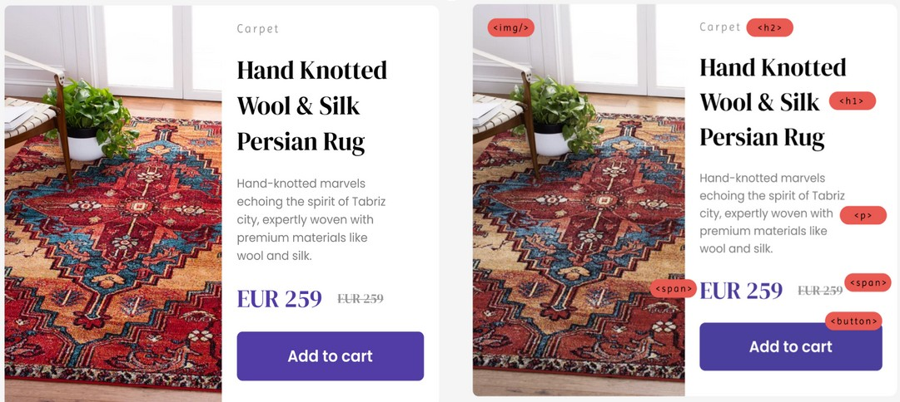

# Homework Week 2

## Read

[Article on CSS Flexbox](https://www.w3schools.com/css/css3_flexbox.asp)

[A guide for future consultation about flexbox](https://github.com/Bakhtiyar-Garashov/flexbox-101)

## Watch
[Video about flexbox](https://www.youtube.com/watch?v=phWxA89Dy94&ab_channel=SlayingTheDragon)

[Introduction to JavaScript](https://www.youtube.com/watch?v=6n4AV5k-7wE&ab_channel=CodingForEverybody)

## Do
You are a junior front-end developer starting a new job and as your first assignment, the company website needs a new ‘product card’ component. The designers are done with the designs and they give it to you, now it’s your time to transform design into living code!

Use flexbox concept

Submit your exercise by Sunday 18:00 to your assigned teacher via Slack. We will post who to send your homework to in Slack as well.
