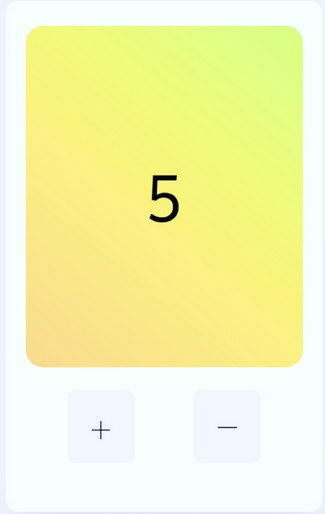

# Hand-in assignment 1

## Do

Create a counter:

- The counter should start at 0
- Make a function to increase the counter
- Make a function to decrease the counter
- Number should increase when hitting ‘+’
- Number should decrease when hitting ‘-’
- (Bonus: Add a reset button to set counter to 0)

Hint: Ask ChatGPT how to run a function after
clicking a button

Submit your assignment by Sunday, April 6th, at 18:00 via a link to your GitHub repository. Send it to your assigned teacher on Slack. We will distribute the assignments.

Next week, we will introduce how to set up a GitHub repository.
