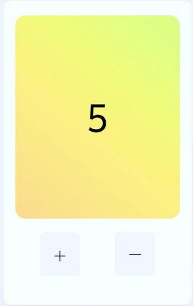

# Homework Week 4

## Do
Create a counter:
- The counter should start at 0 
- Make a function to increase the counter
- Make a function to decrease the counter
- Number should increase when hitting ‘+’
- Number should decrease when hitting ‘-’
- (Bonus: Add a reset button to set counter to 0)

Hint: Ask ChatGPT how to run a function after 
clicking a button

Submit your exercise by Sunday 18:00 to your assigned teacher via Slack. You can find which teacher is assigned in the Google drive.